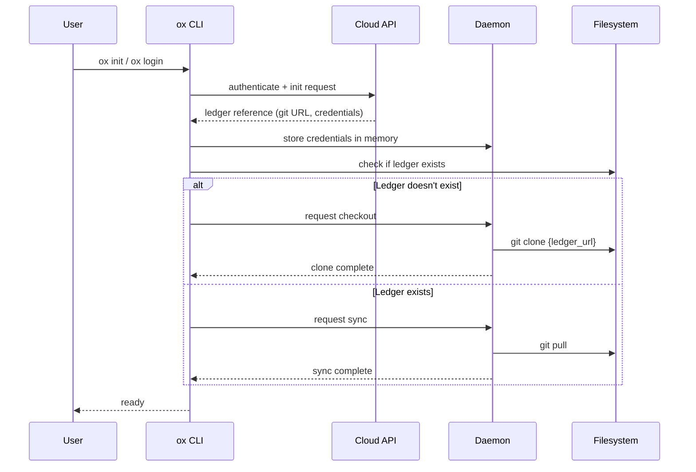
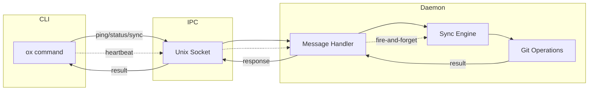
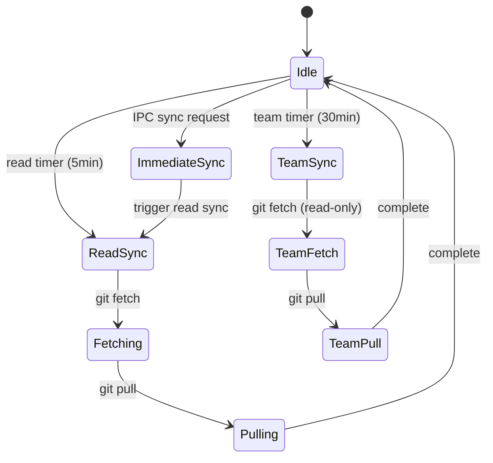
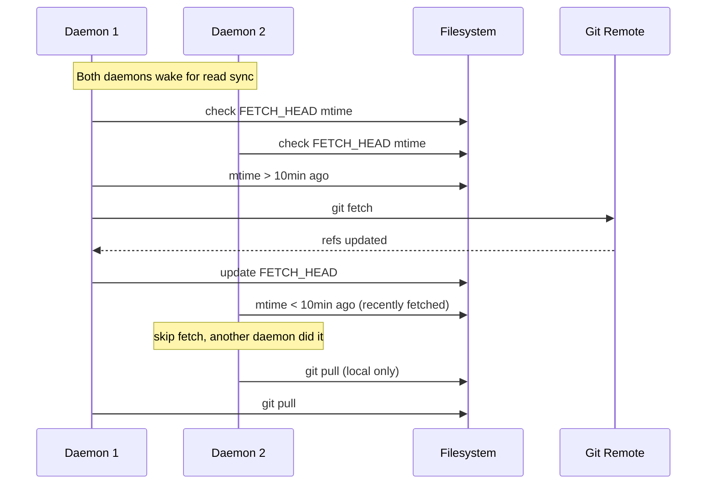
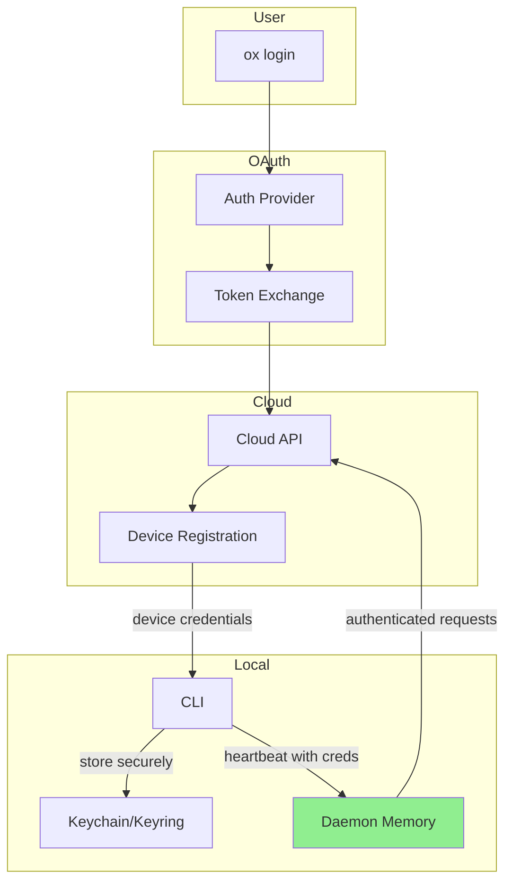

# ADR: Ledger Architecture

- **Status:** Accepted
- **Date:** 2025-01-12
- **Deciders:** SageOx Team

## Context

The ox CLI requires a local ledger system to store sessions and team context. This ledger must:

1. Support offline-first operation with eventual cloud sync
2. Handle multi-device and multi-daemon coordination
3. Maintain security for credentials and sensitive data
4. Integrate with git for version control and collaboration

This ADR documents the final architectural decisions for the ledger system.

## Decision

### 1. Ledger Location

**Decision:** Per-repo sibling directory with `_sageox` suffix, endpoint-namespaced.

| Aspect | Value |
|--------|-------|
| Pattern | `{project_parent}/{repo_name}_sageox/{endpoint_slug}/ledger` |
| Example | `/Users/ryan/Code/myproject` → `/Users/ryan/Code/myproject_sageox/sageox.ai/ledger` |
| Deprecated | `{project_path}_sageox_ledger` (old suffix), `~/.cache/sageox/context` |

**Rationale:**
- Keeps ledger data close to the project it belongs to
- Avoids polluting the project directory itself
- Makes backup and cleanup straightforward
- Supports multiple projects with isolated ledgers
- Endpoint namespacing supports staging/production separation under one sibling dir

### 2. Ledger Creation Flow

**Decision:** Users do NOT create ledgers directly. Ledger references are returned from the cloud API on `ox init` or `ox login`. The daemon handles `git clone` when the ledger doesn't exist locally.



### 3. Git Operations Ownership

**Decision:** Git operations are split between daemon and CLI. The daemon owns read-side operations (clone, fetch, pull) to keep local repos up-to-date. The CLI owns write-side operations (add, commit, push) as part of the session upload pipeline.

| Operation | Owner | Mechanism |
|-----------|-------|-----------|
| clone | daemon | IPC checkout request |
| fetch | daemon | sync timer (read) |
| pull | daemon | sync timer (read) |
| push | CLI | session upload pipeline |
| add/commit | CLI | session upload pipeline |

**Rationale:**
- Daemon handles background sync (pull) without blocking user workflows
- CLI performs writes (add/commit/push) synchronously during session upload, giving the user immediate feedback on success/failure
- Push operations do not require a running daemon, improving resilience
- Clone and fetch still centralized in daemon for credential handling and deduplication
- Read-side centralization in daemon prevents race conditions between CLI instances

### 4. IPC Message Types

| Message | Timeout | Behavior | Purpose |
|---------|---------|----------|---------|
| `ping` | 50ms | synchronous | health check |
| `status` | 5s | synchronous | daemon status |
| `sync` | 30s | synchronous | trigger immediate sync |
| `stop` | 5s | synchronous | graceful shutdown |
| `heartbeat` | none | fire-and-forget | activity signal + credentials |
| `checkout` | 60s | synchronous | clone/checkout ledger |



### 5. Daemon Sync Timers

**Decision:** The daemon runs read-only sync timers to keep local repos up-to-date. Write operations (add/commit/push) are handled by the CLI during session upload.

| Timer | Interval | Operations | Notes |
|-------|----------|------------|-------|
| Read | 5 min | git fetch, pull | cloud changes to local |
| Team Context | 30 min | git fetch, pull | read-only, less frequent |



### 6. Multi-Daemon Coordination

**Decision:** Use `FETCH_HEAD` mtime deduplication to prevent thundering herd when multiple daemons sync.



**Deduplication Logic:**
```
if FETCH_HEAD mtime < (now - dedup_window):
    perform git fetch
    # FETCH_HEAD mtime auto-updated by git
else:
    skip fetch (another process did it recently)

always: perform git pull (safe, uses local refs)
```

### 7. Commit Messages

**Decision:** The CLI authors commit messages during session upload. The daemon does not create commits.

| Context | Format | Example |
|---------|--------|---------|
| Session upload | `session: {sessionName}` | `session: refactor-auth-flow` |
| Future | commit message + git notes | LLM summaries via server-side notes |

**Git Notes Approach (Future):**
- Server adds git notes with LLM-generated summaries
- Does not change commit hash (preserves history)
- Notes fetched separately: `git fetch origin refs/notes/*:refs/notes/*`
- Displayed with: `git log --notes`

### 8. Credential Flow

**Decision:** Credentials flow from OAuth through cloud API to daemon memory. No file storage after initial auth.



**Security Properties:**
- OAuth tokens never touch disk (exchanged for device credentials)
- Device credentials stored in OS keychain/keyring
- Daemon holds credentials in memory for API calls
- Heartbeat passes credentials from CLI to daemon
- No plaintext credential files

## Consequences

### Positive

1. **Offline-first:** Local ledger operations work without network
2. **Secure:** Credentials stay in memory or secure storage
3. **Resilient:** Multi-daemon coordination prevents conflicts
4. **Simple CLI:** Thin client reduces complexity and attack surface
5. **Auditable:** Git history provides full audit trail
6. **Collaborative:** Team context syncs automatically

### Negative

1. **Daemon dependency:** Read-sync operations require running daemon; push operations (session upload) work without daemon
2. **Disk usage:** Each project gets its own ledger copy
3. **Sync latency:** 15-minute timer means up to 15-min delay
4. **Complexity:** Multi-daemon coordination adds edge cases

### Mitigations

| Concern | Mitigation |
|---------|------------|
| Daemon not running | Auto-start on CLI invocation |
| Disk usage | Future: sparse checkout for large ledgers |
| Sync latency | `ox sync` triggers immediate sync |
| Multi-daemon edge cases | FETCH_HEAD deduplication + lock files |

## Related Decisions

- [ADR: Session LFS Storage](adr-session-lfs-storage.md) — why we use meta.json instead of standard git-lfs pointer files
- ADR: Authentication Flow (pending)
- ADR: Team Context Sync (pending)
- ADR: Session Format (pending)

## References

- [Twelve-Factor App](https://12factor.net/) - configuration and backing services
- [Git Internals](https://git-scm.com/book/en/v2/Git-Internals-Plumbing-and-Porcelain) - FETCH_HEAD behavior
- [XDG Base Directory](https://specifications.freedesktop.org/basedir-spec/basedir-spec-latest.html) - considered but rejected for ledger location
