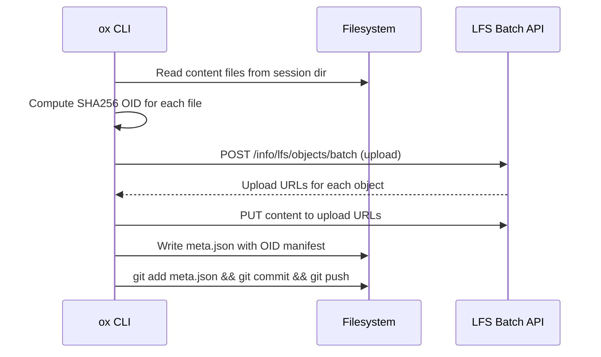
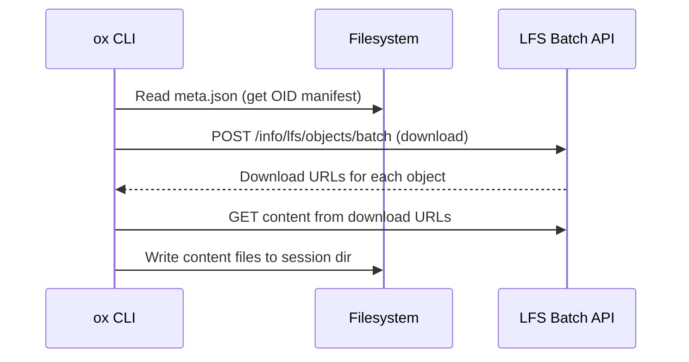

<!-- doc-audience: ai -->
# ADR: Session Content Storage via Custom LFS (No Pointer Files)

- **Status:** Accepted
- **Date:** 2025-01-12 (documented 2026-02-08)
- **Deciders:** Ajit Banerjee, SageOx Team
- **Relates to:** [ADR: Ledger Architecture](adr-ledger-architecture.md)

## Context

Session recordings (raw.jsonl, events.jsonl, HTML views, summaries) can be large (10KB–1GB+). They must be stored in the ledger git repo for collaboration and history, but committing large binary-ish files directly to git bloats the repo and slows clones.

Git LFS (Large File Storage) solves this by storing large files on a separate blob server and replacing them with small "pointer files" in the git tree. The standard git-lfs workflow uses smudge/clean filters: on checkout, pointer files are automatically replaced with real content; on commit, content is automatically uploaded and replaced with pointers.

We needed to decide: use standard git-lfs pointer files, or build a custom content-addressed storage layer on top of the LFS Batch API?

## Decision

**Use the Git LFS Batch API directly for blob upload/download, but do NOT use standard git-lfs pointer files.** Instead, store LFS object IDs (OIDs) in a custom `meta.json` manifest that is the only git-tracked file per session.

### How it works

```
sessions/<session-name>/
├── meta.json        ← git-tracked (committed + pushed)
├── raw.jsonl        ← .gitignored, stored in LFS blob storage
├── events.jsonl     ← .gitignored, stored in LFS blob storage
├── summary.md       ← .gitignored, stored in LFS blob storage
├── session.html     ← .gitignored, stored in LFS blob storage
├── session.md       ← .gitignored, stored in LFS blob storage
└── summary.json     ← git-tracked (small, ~1-50KB, no LFS)
```

Content files are explicitly `.gitignored` via patterns in `sessions/.gitignore`:
```
*.jsonl
*.html
*.md
!meta.json
```

`meta.json` contains the OID manifest — a map of filename to `{oid, size}`:
```json
{
  "version": "1.0",
  "session_name": "2026-01-06T14-32-ryan-Ox7f3a",
  "agent_id": "Ox7f3a",
  "files": {
    "raw.jsonl": {"oid": "sha256:abc123...", "size": 156280},
    "events.jsonl": {"oid": "sha256:def456...", "size": 8420}
  }
}
```

### Upload flow (CLI-owned)



### Download flow (CLI-owned, on demand)



## Alternatives Considered

### Alternative 1: Standard git-lfs pointer files

Use `git lfs track "sessions/**/*.jsonl"` and let the smudge/clean filters handle everything.

**Pros:**
- Zero custom code for upload/download — git handles it
- Standard tooling; familiar to developers
- `git lfs gc` can reclaim orphaned blobs server-side

**Cons:**
- **Hard dependency on git-lfs binary.** Every machine that touches the ledger repo needs `git-lfs` installed and `git lfs install` run. This includes the daemon, CI, and every developer workstation.
- **Eager download.** `git checkout` triggers the smudge filter, downloading ALL content files automatically. A ledger with 500 sessions would download every session's raw transcript on clone.
- **Daemon complexity.** The daemon runs `git pull` on ledger repos. With pointer files, it would need git-lfs configured, authenticated, and its cache managed.
- **No selective download.** Standard git-lfs downloads everything or nothing (unless using `git lfs fetch --include` patterns, which are fragile and global).

### Alternative 2: Commit content files directly to git (no LFS)

Just commit raw.jsonl etc. directly.

**Pros:**
- Simplest implementation
- No LFS infrastructure needed

**Cons:**
- Ledger repos become enormous quickly (sessions are 10KB–1GB each)
- `git clone` downloads all historical content
- `git fetch` transfers full file content for every new session
- Completely unworkable at scale

### Alternative 3: External object store (S3/GCS) with URL references

Store content in S3/GCS, reference by URL in meta.json.

**Pros:**
- Decoupled from git entirely
- Standard cloud storage scaling

**Cons:**
- New infrastructure dependency (S3 bucket, IAM, CORS)
- Separate auth system from git credentials
- Loses the "git is the protocol" simplicity
- More complex failure modes (partial uploads, eventual consistency)

## Rationale

The custom LFS approach was chosen because it satisfies three constraints simultaneously:

### 1. No git-lfs binary dependency

From `internal/lfs/client.go:1-2`:
> Package lfs provides a pure-HTTP client for the Git LFS Batch API. No git-lfs binary required.

The LFS Batch API (`POST /info/lfs/objects/batch`) is a standard HTTP/JSON protocol documented at [git-lfs.com/spec](https://github.com/git-lfs/git-lfs/blob/main/docs/api/batch.md). Any HTTP client can speak it. Our `lfs.Client` implements upload and download in ~200 lines of Go, using the same protocol that GitLab/GitHub LFS servers already support.

This means:
- Users don't need `git-lfs` installed to use `ox`
- The daemon clones/pulls ledger repos with plain `git` — no filter configuration
- CI and containers work without extra setup
- One fewer binary in the dependency tree

### 2. Lazy (on-demand) content download

Standard git-lfs downloads content eagerly on checkout. Our design makes download explicit:

- `git pull` on the ledger fetches only `meta.json` files (~1KB each)
- Content files are downloaded only when requested via `ox session view` or `ox session download`
- `CheckHydrationStatus()` (`internal/lfs/meta.go:97-120`) reports which files are local vs. remote

This matters because a team's ledger may contain hundreds of sessions from many coworkers. Downloading every session's raw transcript just to run `ox session list` would be wasteful and slow.

### 3. Simpler daemon architecture

The daemon's job is to keep the ledger repo up-to-date via `git fetch` + `git pull --rebase` (see [ADR: Ledger Architecture](adr-ledger-architecture.md), Section 3). With standard pointer files, the daemon would need:
- git-lfs installed and configured
- LFS authentication (separate from git auth in some setups)
- LFS cache management (`.git/lfs/objects/`)
- Smudge filter error handling

With meta.json, the daemon pulls only small JSON files. Content download is entirely the CLI's responsibility, triggered by explicit user action.

## Consequences

### OID storage: meta.json is the only index

OIDs exist ONLY in `meta.json`. There are no pointer files, no `.gitattributes` LFS tracking rules, and no `.git/lfs/` directory in the ledger repo. The `Files` map in `SessionMeta` (`internal/lfs/meta.go:25`) is the authoritative mapping from filename to LFS blob.

**Why OIDs can't live inside the content files:** OIDs are computed as SHA256 of file content. You can't embed an OID inside the file it identifies — that creates a circular dependency (the hash depends on the content which includes the hash).

### Recovery path

If ledger upload fails during `ox session stop`, the session data is safe in the local cache. The recovery path:

```
cache/sessions/<name>/raw.jsonl  →  re-upload to LFS  →  get new OIDs  →  write new meta.json
```

This is implemented in `retrySessionUpload()` (`cmd/ox/doctor_session_upload_retry.go`). The cache is always the authoritative copy during recovery.

### Orphaned blob risk

**If meta.json is lost AND the local cache is deleted, LFS blobs are permanently orphaned on the server.** No index exists to find them.

This risk is acceptable because:

1. **meta.json has full git history protection.** It's committed and pushed to the ledger repo. Losing it requires git history corruption.
2. **Cache cleanup only happens after confirmed upload.** The cache is not deleted until meta.json is committed and pushed.
3. **Double failure required.** Both git history corruption AND cache deletion must happen simultaneously.
4. **Same risk as standard pointer files.** Standard git-lfs pointer files are also git-tracked; losing them also orphans blobs. The risk profile is equivalent.
5. **Session data is best-effort, not transactional.** A lost session is unfortunate but not catastrophic — it's a conversation recording, not source code.

**Future mitigation:** A server-side GC could scan all `meta.json` files across ledger history to build a complete OID set, then compare against LFS storage to find orphans. This is not needed for MVP.

### summary.json: a special case

`summary.json` is a small file (~1-50KB) that does NOT go through LFS. It's committed directly to git alongside `meta.json` via `ox session push-summary`. This is by design:
- Small enough that LFS adds overhead without benefit
- Generated after session stop (by the calling agent), so it can't be included in the initial LFS upload
- Git-tracked for the same reasons as meta.json (history, collaboration)

## Implementation References

| Component | File | Purpose |
|-----------|------|---------|
| `lfs.Client` | `internal/lfs/client.go` | Pure-HTTP LFS Batch API client |
| `lfs.SessionMeta` | `internal/lfs/meta.go` | meta.json struct and read/write |
| `lfs.FileRef` | `internal/lfs/meta.go:29` | OID + size for a single content file |
| `lfs.ComputeOID` | `internal/lfs/oid.go` | SHA256 computation |
| `uploadSessionLFS()` | `cmd/ox/session_upload.go:30` | Upload pipeline (read files → batch API → write meta) |
| `commitAndPushLedger()` | `cmd/ox/session_upload.go:167` | Git commit + push for meta.json |
| `retrySessionUpload()` | `cmd/ox/doctor_session_upload_retry.go:215` | Doctor recovery path |
| `CheckHydrationStatus()` | `internal/lfs/meta.go:97` | Check which content files are local |
| `ensureSessionsGitignore()` | `cmd/ox/session_upload.go:148` | .gitignore for content files |

## Origin

This design was articulated by Ajit Banerjee during early architecture discussions:

> "We shoved ourselves as an LFS replacement, but we played with Git."
> — [Project Origin Transcript](../adr-grounding/project-origin-transcript.md), line 763

The intent was to use git as the transport and history layer while bypassing git-lfs's filter machinery in favor of explicit, API-driven content management.
