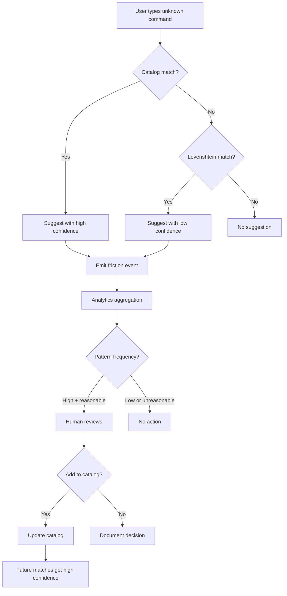

<!-- doc-audience: ai -->

# UX Friction Philosophy

This document explains the philosophical foundation for ox's approach to command-line friction—the moments when a user or agent types something that doesn't quite work.

## Why This Exists

Coding agents (Claude Code, Cursor, GitHub Copilot, etc.) frequently hallucinate APIs, commands, and flags. They extrapolate from patterns they've learned and make reasonable guesses that don't always match the actual CLI interface.

Instead of failing hard when an agent guesses wrong, this system:
1. Detects what they were trying to do (infer intent)
2. Suggests or auto-executes the correct command
3. Teaches them the correct syntax for next time

We "meet them where they are" by recognizing that many CLI failures represent reasonable intent that we can act on.

## Core Principle: Help, Don't Just Fail

Traditional CLIs respond to unknown commands with:

```
Error: unknown command "agent-list"
Run 'ox --help' for usage.
```

Our principle: **When a command fails, provide actionable correction.**

```
Error: unknown command "agent-list"

Did you mean?
  ox agent list
```

This transforms failure into guidance.

## Desire Paths: Steve Yegge's Insight

The term "desire path" comes from urban planning—the worn trails across lawns where people actually walk. Steve Yegge applied this concept to software in "The Future of Coding Agents" (2025).

### The Observation

When agents (and humans) use a CLI, they extrapolate commands from patterns:

- Saw `ox agent list` → tries `ox agents` (pluralization pattern)
- Saw `ox init` → tries `ox setup` (synonym pattern)
- Saw `ox agent prime` → tries `ox prime` (shortcut pattern)

Yegge's insight: **When a guess is reasonable, that's a signal about how the tool should work.**

### The Distinguishing Question

> "Would someone who understands the tool think this should work?"

If yes, that's a desire path. If no, that's just a typo.

| Input | Desire Path? | Reasoning |
|-------|--------------|-----------|
| `ox agents` | Yes | Plural form of existing `ox agent` |
| `ox setup` | Yes | Synonym for `ox init` |
| `ox agnet list` | No | Typo, not reasonable expectation |
| `ox agent ls` | Yes | Unix convention for `list` |

## Where We Diverge from Yegge

Yegge advocates implementing every discovered desire path as a permanent alias. His position: if someone tries it, make it work.

**Our position differs: Surface desire paths through analytics, then decide which to implement.**

### Why Not Automatic Aliasing?

1. **Not every pattern deserves permanence.** Some are one-off quirks from a single user's mental model, not universal expectations.

2. **Maintenance cost compounds.** Each alias is code to maintain, test, and document.

3. **Some patterns are anti-patterns.** A user might try `ox delete-all` but we don't want that to work.

4. **Context matters.** `ox prime` might be reasonable now but confusing later.

### Analytics-Driven Discovery



This flow ensures:
- Every friction event is captured
- Patterns emerge from data, not hunches
- Humans decide what becomes permanent
- Rejected patterns are documented

## Tiered Response Model

Not all suggestions carry equal weight:

| Confidence | Threshold | Source | Action |
|------------|-----------|--------|--------|
| High | ≥ 0.85 | Catalog + AutoExecute | Auto-execute + emit |
| Medium | ≥ 0.70 | Catalog (no AutoExecute) | Suggest + emit |
| Low | < 0.70 | Levenshtein | Suggest only |

### Auto-Execute: The High Bar

Auto-execution is reserved for:
1. **Catalog entries** with `auto_execute: true`
2. **Confidence ≥ 0.85**
3. **Unambiguous intent** (single best match)

This is intentionally conservative. Auto-executing the wrong command is worse than suggesting the right one.

## Emit-to-Learn: Teaching Without Aliases

Even when we don't add an alias, we emit the correction.

### For Agents

The emitted suggestion teaches the agent for the current session. The agent reads:

```
Did you mean?
  ox agent list
```

Learns `ox agent list` is correct, uses it going forward. No permanent alias needed—the agent adapted.

### For Humans

Humans see the correct command and learn the actual interface. This is better than silent aliasing because:
- User learns the "canonical" command
- Documentation stays accurate
- Future help-seeking is more effective

## What Goes in the Catalog

### Include

- **Renamed commands:** Migration paths from old to new names
- **Common desire paths:** Patterns seen frequently across users
- **Intentional aliases:** Deliberate shortcuts we choose to support
- **Convention patterns:** Unix conventions (`ls` → `list`)

### Exclude

- **Every typo:** `agnet` → `agent` is Levenshtein's job
- **One-off guesses:** Patterns without evidence of frequency
- **Anti-patterns:** Commands we explicitly don't want to work
- **Ambiguous shortcuts:** `ox p` could be `prime`, `project`, `push`

## The Distinguishing Question

When evaluating whether something should be in the catalog, ask:

> "If I explained ox to a competent developer and they tried this command, would I think 'yeah, that should work'?"

**If yes:** Consider adding to catalog (with analytics to confirm frequency)

**If no:** Let Levenshtein handle it as a typo

## Summary

| Principle | Implementation |
|-----------|----------------|
| Help, don't just fail | Always suggest when possible |
| Desire paths are signals | Capture and analyze, don't auto-implement |
| Analytics over intuition | Let data reveal patterns |
| Tiered confidence | High → auto-execute, Medium → suggest, Low → suggest only |
| Emit to teach | Corrections educate without permanent aliases |
| Curated catalog | Include common patterns, exclude one-offs |

The goal is a CLI that feels intelligent without being presumptuous—one that helps users find the right path without littering the interface with every possible alias.
