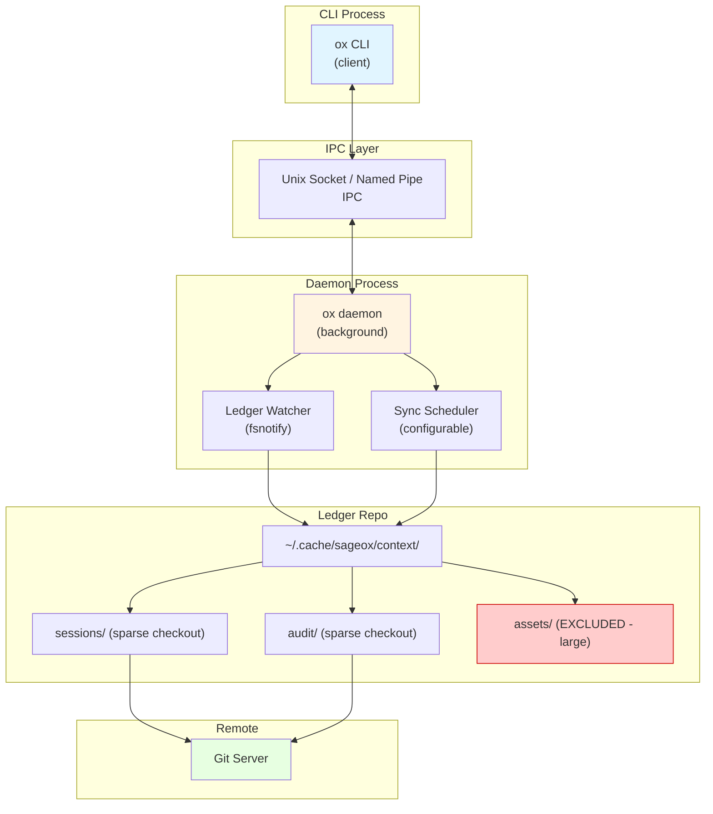
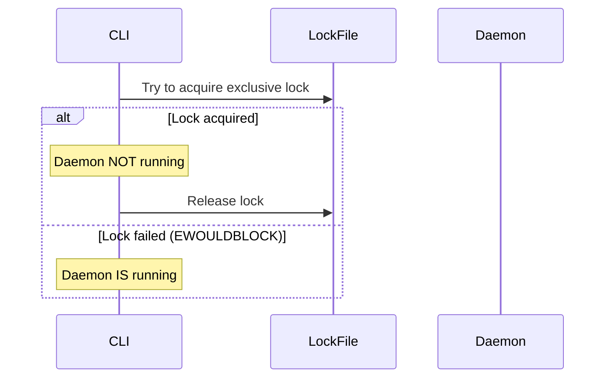
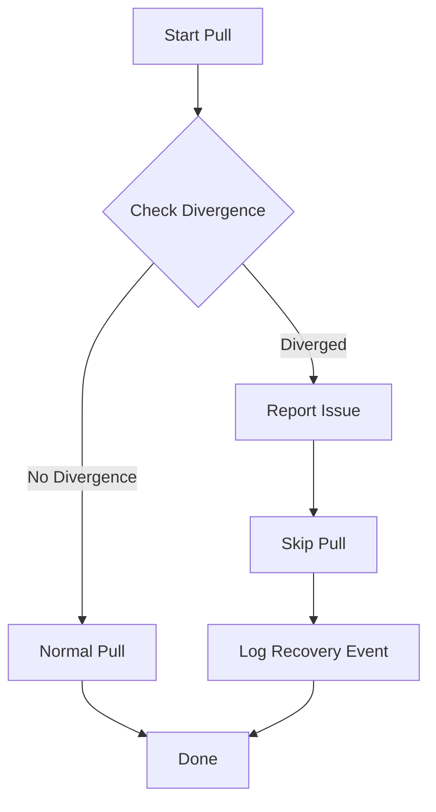
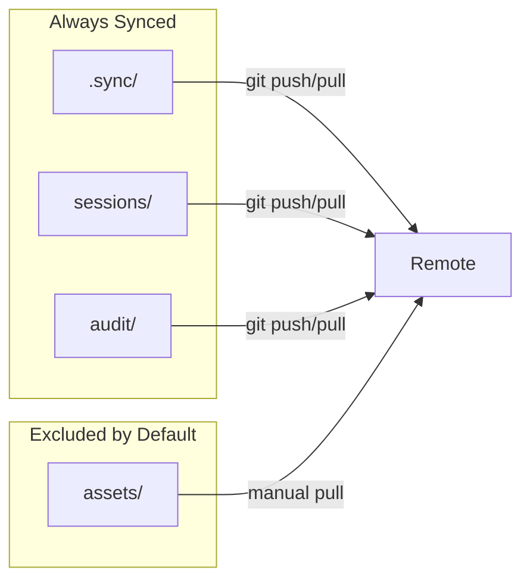

# Ledger Sync Daemon

Background daemon for continuous ledger synchronization with configurable intervals and sparse checkout support for large repositories.

## Architecture



## Sync Interval Configuration

| Setting | Default | Description |
|---------|---------|-------------|
| `sync_interval_read` | 15m | Pull interval (fetch from remote) |
| `debounce_window` | 500ms | Batch rapid changes before commit |

**Config location**: `~/.config/sageox/config.yaml`

```yaml
daemon:
  sync_interval_read: 15m    # how often to pull
  debounce_window: 500ms     # batch rapid changes
  auto_start: true           # start on first ox command
```

## Component Responsibilities

### IPC Server
- Unix sockets on macOS/Linux, named pipes on Windows
- Handles client requests: ping, status, sync, stop
- Thread-safe message handling with JSON protocol

### Sync Scheduler
- Read-only sync with configurable pull interval
- Exponential backoff for failed pull operations
- Force push detection and recovery
- Queue pull operations during disconnected state

### Ledger Watcher
- fsnotify-based file system monitoring
- Debounces rapid changes (500ms default)
- Filters ignored patterns (.git, etc.)
- Triggers sync scheduler on file changes

## Liveness Detection

Uses file locks instead of PID files (PIDs get reused after crashes):



**Implementation**:
- Unix: `flock(fd, LOCK_EX | LOCK_NB)`
- Windows: `LockFileEx(hFile, LOCKFILE_EXCLUSIVE_LOCK | LOCKFILE_FAIL_IMMEDIATELY, ...)`

## Force Push Detection and Recovery



Detection uses `git rev-list --left-right --count origin/main...HEAD`:
- If both ahead AND behind counts are non-zero = diverged (force push detected)
- Daemon reports the issue and skips the pull; CLI is responsible for add/commit/push and resolving local state

## Sparse Checkout Strategy

Large ledgers use sparse checkout to exclude bulky assets:



**Setup**:
```bash
git sparse-checkout init --cone
git sparse-checkout set .sync/ sessions/ audit/
# assets/ automatically excluded
```

## Dual-Mode Pattern

Every **pull** operation works with AND without daemon. Push (add/commit/push) is always performed directly by the CLI and never goes through the daemon.

```go
// Daemon performs pull via SyncScheduler.doPull() (internal/daemon/sync.go)
// CLI triggers pull via IPC when needed:
client := daemon.NewClient()
client.SyncWithProgress(...)  // delegates to daemon's doPull
```

## IPC Protocol

### Message Types

| Type | Direction | Description |
|------|-----------|-------------|
| `ping` | Client -> Server | Health check |
| `status` | Client -> Server | Get daemon status |
| `sync` | Client -> Server | Request immediate sync |
| `stop` | Client -> Server | Graceful shutdown |

### Message Format

```json
{
  "type": "status",
  "payload": {}
}
```

### Response Format

```json
{
  "success": true,
  "data": {
    "running": true,
    "pid": 12345,
    "uptime": 3600000000000,
    "ledger_path": "/path/to/ledger",
    "last_sync": "2026-01-10T14:30:00Z"
  }
}
```

## CLI Commands

```bash
ox daemon start     # Start daemon in background
ox daemon stop      # Graceful shutdown
ox daemon status    # Show running status, sync intervals
ox daemon logs      # Show recent daemon activity
```

## Platform Support

| Platform | IPC | File Locking | File Watching |
|----------|-----|--------------|---------------|
| macOS | Unix sockets | flock | FSEvents |
| Linux | Unix sockets | flock | inotify |
| Windows | Named pipes | LockFileEx | ReadDirectoryChangesW |

## File Locations

| File | Path | Purpose |
|------|------|---------|
| Socket | `$XDG_RUNTIME_DIR/sageox-daemon.sock` | IPC communication |
| Lock | `$XDG_RUNTIME_DIR/sageox-daemon.lock` | Liveness detection |
| PID | `$XDG_RUNTIME_DIR/sageox-daemon.pid` | Process identification |
| Log | `~/.cache/sageox/daemon.log` | Activity logging |

## Memory Budget

- Target: 10-15MB idle
- Acceptable: Up to 30MB under load
- No SQLite dependency for lightweight operation
