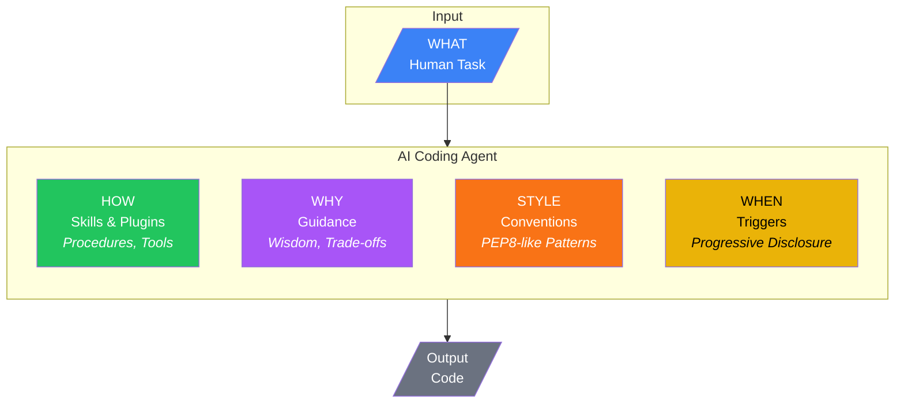

# Agent Dimensions: Skills vs Guidance

AI coding agents receive context from multiple sources. Understanding these dimensions helps you know where to invest effort and how different tools complement each other.

## The Five Dimensions

| Dimension | Source | Question Answered | Learnable from Code? |
|-----------|--------|-------------------|---------------------|
| **WHAT** | Human | "What should I build?" | N/A |
| **HOW** | Skills/Plugins | "What tools/procedures?" | N/A (bundled) |
| **WHY** | Guidance | "What trade-offs/judgment?" | **No** - requires curation |
| **WHEN** | Triggers | "When is this relevant?" | Partial |
| **STYLE** | Conventions | "How should it look?" | **Yes** - `ox learn` |

---

## WHAT — The Task (Human Input)

The goal comes from the human. This is the starting point for all agent work.

**Examples:**
- "Build a user authentication system"
- "Fix the memory leak in the worker process"
- "Add dark mode to the settings page"

---

## HOW — The Procedure (Skills & Plugins)

Skills and plugins provide tools and procedures. They tell agents **HOW** to accomplish tasks—the executable capabilities.

**Sources:**
- [Agent Skills](https://agentskills.io) - Open format for bundled instructions + scripts
- Claude Code plugins
- Cursor extensions
- MCP servers
- IDE integrations

**Characteristics:**
- Executable (scripts, tools, APIs)
- Bundled with the skill/plugin
- Teach procedures, not judgment

**Example:** A database migration skill provides the *procedure* for running migrations, but not *which* database to choose or *when* migrations are appropriate.

---

## WHY — The Wisdom (Guidance)

Guidance provides judgment and trade-offs. It tells agents **WHY** to make certain choices—the reasoning behind decisions.

**Examples:**
- "Use JWT over sessions because your infrastructure is stateless"
- "Prefer Postgres over DynamoDB for this query pattern due to complex joins"
- "Avoid this pattern because it creates security vulnerabilities"

**Characteristics:**
- Advisory (influences reasoning, doesn't mandate)
- Cannot be inferred from code
- Requires human curation and expertise
- Non-deterministic outcomes

**Why guidance can't be learned from code:**

Scanning a codebase reveals *what* patterns exist, but not:
- *Why* those patterns were chosen
- *When* to deviate from them
- *What trade-offs* were considered
- *Whether* they're technical debt or intentional design

A codebase full of callbacks doesn't mean callbacks are right—it might be legacy code awaiting refactoring.

---

## STYLE — The Form (Conventions)

Conventions define patterns and consistency. Like PEP8, they define **HOW IT LOOKS**—the form code should take to fit in.

**Examples:**
- Naming conventions (`snake_case` for functions, `PascalCase` for classes)
- File structure patterns (`src/components/`, `tests/unit/`)
- Tool choices (pnpm over npm, Biome over ESLint)
- Tagging standards (required: `env`, `owner`, `cost-center`)
- Error handling patterns

**Characteristics:**
- Prescriptive rules (MUST/SHOULD format)
- Testable and enforceable (linting, CI checks)
- Deterministic (compliant or not)
- Can be discovered from existing code

**Why conventions CAN be learned:**

Pattern recognition on existing code discovers observable facts:
- "87% of files use `snake_case` naming"
- "All React components use functional patterns"

`ox learn` scans your codebase to discover these patterns automatically.

---

## WHEN — The Timing (Triggers)

Triggers enable progressive disclosure. They determine **WHEN** context becomes relevant to an agent's current task.

**Examples:**
- Keyword triggers: "security", "database", "authentication"
- File pattern triggers: `src/auth/**`, `src/api/**`
- Content triggers: regex patterns in code

**Characteristics:**
- Context-aware activation
- Rate-limited to prevent redundant fetches
- Scoped by conversation, filenames, or file content

Triggers prevent context overload by loading guidance only when relevant.

---

## Skills vs Ox: Complementary, Not Competing

| Aspect | Skills/Plugins | Ox (Guidance + Conventions) |
|--------|---------------|----------------------------|
| **Focus** | HOW (procedures) | WHY + STYLE + WHEN |
| **Nature** | Executable | Advisory |
| **Source** | Bundled scripts | Curated catalog + learned patterns |
| **Testable** | Yes (runs or doesn't) | Conventions: Yes, Guidance: No |
| **Updates** | Manual file changes | Server-pushed, cached locally |

**The key insight:**

> **Skills give agents hands. Ox gives agents taste and judgment.**

You need both. Skills without guidance leads to agents that can do things but don't know when they should. Guidance without skills leads to agents that know what's right but can't execute.

---

## The Learnability Distinction

This is the critical insight for understanding where human effort is needed:

| Dimension | Can be learned? | Why? |
|-----------|-----------------|------|
| **WHY** (Guidance) | No | Intent, trade-offs, wisdom aren't encoded in code |
| **STYLE** (Conventions) | Yes | Patterns are observable facts about the codebase |

**Implications:**

- **Guidance** requires ongoing human curation—SageOx maintains a catalog of infrastructure wisdom, augmented by team-specific overrides
- **Conventions** can bootstrap from existing code—`ox learn` discovers patterns, which humans then refine and formalize

---

## Working Together: An Example

Consider an agent tasked with "Add a new API endpoint for user preferences":

1. **WHAT** (Human): The task itself—add an API endpoint
2. **HOW** (Skills): Express routing skill shows *how* to create endpoints
3. **WHY** (Guidance): SageOx guidance advises *why* to use rate limiting, *why* to validate input with zod, *why* to prefer REST over GraphQL for this use case
4. **STYLE** (Conventions): Team conventions specify *how it should look*—naming pattern (`/api/v1/users/:id/preferences`), response format, error structure
5. **WHEN** (Triggers): Guidance activates because the task involves "API" keyword and touches `routes/` directory

The result: An endpoint that not only works (HOW) but follows team patterns (STYLE) and makes architecturally sound choices (WHY).
