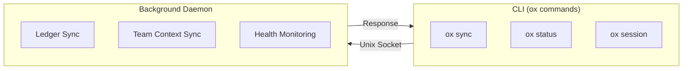
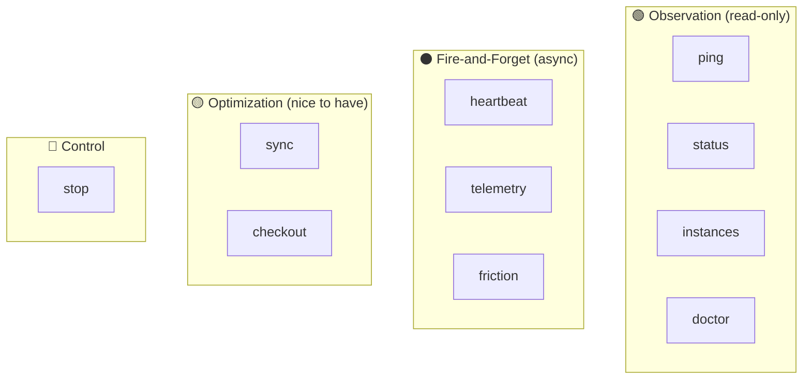

<!-- doc-audience: human -->
# IPC Architecture

How the CLI and daemon communicate.

## The Big Picture



## Philosophy: Independent Daemon

The daemon runs **autonomously**. The CLI can observe and nudge it, but never controls it.

| Principle | What it means |
|-----------|---------------|
| **IPC is optional** | Daemon works even if every CLI call fails |
| **Fire-and-forget** | Heartbeats/telemetry never block the CLI |
| **Self-managing** | Starts on first use, shuts down after 1hr idle |

## Message Types



### What happens if IPC fails?

| Message | Fallback behavior |
|---------|-------------------|
| `status` | CLI shows "daemon not running" |
| `heartbeat` | Daemon uses cached credentials |
| `sync` | Daemon syncs on next timer tick (≤5 min) |
| `checkout` | **CLI falls back to direct git clone** |
| `stop` | User may need `kill -9` |

### IPC Calls vs Operations

**Important distinction:**

```
IPC Call "sync"     →  Optional (nudge to sync NOW instead of later)
Sync OPERATION      →  CRITICAL (daemon's core job, runs on timer)
```

The daemon performs critical operations (syncing ledgers, team contexts) **independently**. IPC just lets the CLI observe or trigger things earlier.

## Critical Path Exception: Clone

Clone is the **only** operation with a CLI fallback. Why?

```
┌────────────────────────────────────────────────────────┐
│  Without clone → No ledger → SageOx doesn't work      │
│  First-run experience CANNOT be blocked by daemon     │
└────────────────────────────────────────────────────────┘
```

See `cmd/ox/doctor_git_repos.go:cloneViaDaemon()` for the fallback implementation.

## Socket Location

| Platform | Path |
|----------|------|
| macOS/Linux | `$XDG_RUNTIME_DIR/sageox/<workspace_id>.sock` |
| Windows | `\\.\pipe\sageox-daemon` |

Each workspace gets its own socket (SHA256 hash of path, first 8 chars).

## Timeouts

| Category | Timeout | Examples |
|----------|---------|----------|
| Fire-and-forget | 50ms | heartbeat, telemetry |
| Fast commands | 500ms | ping, status |
| Sync | 30s | ledger pull |
| Clone | 60s | checkout |

## Quick Reference

For detailed API specs, see [docs/ai/specs/ipc-architecture.md](../ai/specs/ipc-architecture.md).

Key files:
- `internal/daemon/ipc.go` - Core IPC implementation
- `cmd/ox/heartbeat.go` - Fire-and-forget example
- `cmd/ox/doctor_git_repos.go` - Clone fallback (critical path exception)
